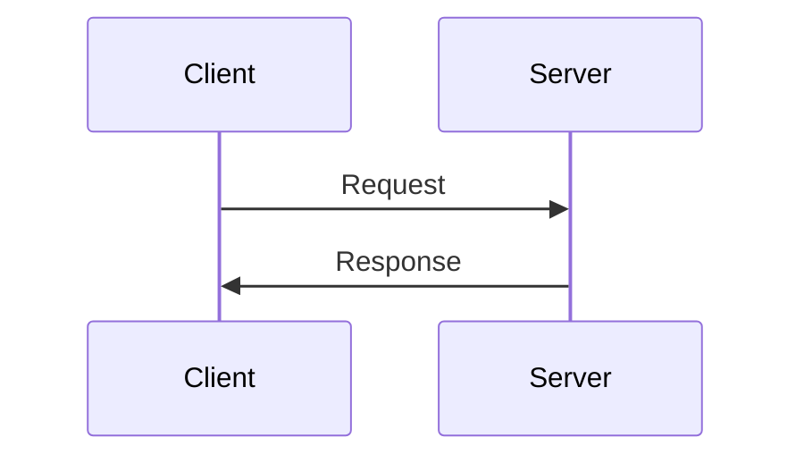

It is important to understand the different types of network devices and their functions. This will help you to understand how to configure and troubleshoot networks.

First we'll define what a network is. A computer network is a digital telecommunications network which allows nodes to share resources. Commonly the network has two types of nodes: servers and clients. Servers are devices that provide resources, functions or services for clients, and clients are devices that consume those resources, functions or services provided by servers.

It's important denote that the same device can be work as a server and a client in some situations. For example, a computer can be a server for a web service and a client for a file server.

## Common network devices

A network device is a device that is connected to a network and it can be a server or a client. The most common network devices are:

- Switches
- Routers
- Firewalls

### Switches

This devices have many network interfaces/ports for end hosts to connect to (usually 24+). Also, provide connectivity to hosts within the same LAN (Local Area Network). It's important to note that switches are Layer 2 devices, so they don't have any routing capabilities, so don't provide connectivity between different LANs.

### Routers

Routers are devices that provide connectivity between different LANs. They are Layer 3 devices, so they have routing capabilities. Routers have many network interfaces/ports for end hosts to connect to (usually 4+).

### Firewalls

Firewalls are devices that provide security for a network. They monitor traffic and block any unwanted traffic based on configured rules. It's important denote that can be placed "inside" or "outside" the network.

The firewalls has some types:

- Network Firewalls: Are hardware devices that filter traffic between networks. This provide some basic features.
- Host based firewalls: Are software applications that runs on a host and filter traffic between the host and the network. This provide some basic features.
- Next Generation Firewalls (NGFW): This provide some modern and advanced features.
