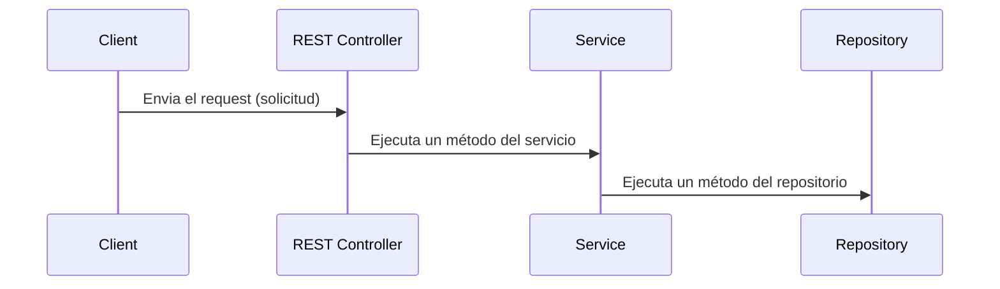
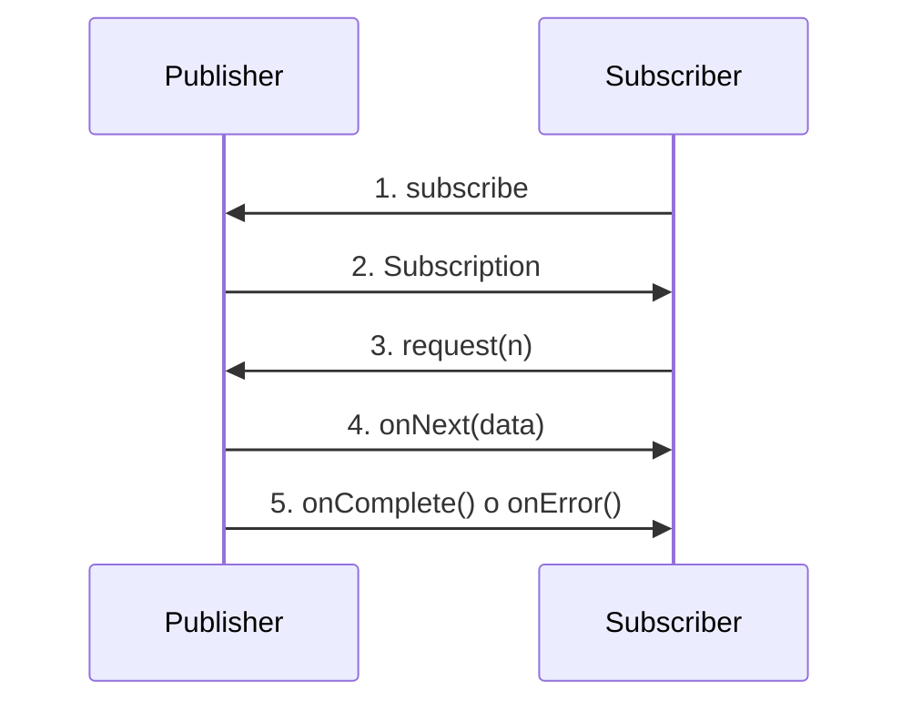

---

[Documentación]()

---

# ¿Qué es Spring?

Spring Framework es un framework popular para la creación de aplicaciones web y empresariales. Este framework es popular por las siguientes razones:

- Inyección de dependencias
- Fácil de usar
- Buena integración con otros frameworks de Java, como JPA/Hibernate ORM, Struts/JSF, etc.
- Framework Web MVC para la creación de aplicaciones web

Este framework también tiene algunos problemas:

- Las aplicaciones de spring necesitan muchas configuraciones, por ejemplo cuando se desarrollamos una aplicación con spring MVC necesitamos configurar lo siguiente:
  - Configurar

Spring Boot lo que hace es crear más fácilmente aplicaciones basadas en Spring Framework sin requerir escribir manualmente las configuraciones básicas necesarias para la funcionalidad de la aplicación.

# Spring Boot Starters

Los starters están pre-configurados con las dependencias más utilizadas comúnmente en la biblioteca, así que tú ya no tienes que preocuparte por la compatibilidad entre las versiones de estas bibliotecas ni tampoco es necesario que las configures manualmente.
Ejemplos:

- Si tu añades `spring-boot-starter-web` la aplicación de spring boot asume que estas tratando de crear una aplicación web basada en spring mvc.

Dentro de src se mantendra el codigo de la aplicacion, dentro estara la carpeta main (relacionado con el desarrollo del codigo fuente) y la de test, dentro de main estara java (relacionado al codigo de java) y resources (static files, properties and config files)
application.properties -> define all the application level properties, templates -> html templates, static -> css, js y estaticos
utilizamos mvnw para crear un wrapper de maven para crear y ejecutar el proyecto de spring boot maven sin instalar maven en la maquina local

```sh
./mvnw clean install
```

Dentro de repositorio se necesitan dos datos, el primero es sobre el cual se van a implementar los métodos y mantenimiento de la data del repositorio (inserción, actualización, etc). El segundo se trata de el tipo de dato de el campo Id de esta entidad.

El servicio es el intermediario entre la clase repository y los controles rest API. Para la creación de un servicio se crea un paquete llamado `service`, posteriormente dentro de este se crea una clase con la nomenclatura `<Resource>Service` y se crea una clase con la nomenclatura `<Resource>ServiceImp` la cual implemente la interfaz creada anteriormente.

Posteriormente a eso creamos un controller, es importante recalcar que el controller será el encargado de realizar un comportamiento o acción basado en la solicitud que se envía por el cliente:



# API Gateway

Es el intermediario entre los request del cliente y los microservices del backend.
Este tiene como primera misión centralizar toda la seguridad de la arquitectura. Además de esto se encargará del mantenimiento de usuarios, pudiendo registrar, dar de alta nuevos usuarios, así como realizar el login de usuarios existentes y devolver un JWT a los usuarios conectados.
También estará encargado de redireccionar todos los request autenticados a un microservice.

user will be the slave and the student will be the master

JPA es una especificación que propone como se debe implementar un ORM en java, hibernete es un proovedor que implementa este ORM

# Pruebas unitarias

Diseño -> Escribir nuestro código -> Probar nuestro código

Repository > acceso a datos
Controller -> Exposición de datos
Service -> Lógica de negocio
Component -> Fuera de estas categorías

Bajo acoplamiento (dependencia entre clases), alta cohesion (la ultima indica que una clase debe hacer una sola cosa y la debe hacer bien).
Los beans son objetos que son administrados por spring

# Diferencia entre alto y bajo acoplamiento

Antes de mostrar las diferencias entre los acoplamientos es necesario definir en que consiste este. El acoplamiento es la dependencia que existe entre las clases, un ejemplo de alto acoplamiento puede ser el siguiente panorama:

Se tiene a un viajero, el cual dispone de distintos vehículos para desplazarse por la zona, entre los vehículos se encuentran:

- Carro

```java
public class Carro {
  public void desplazarse() {
    System.out.println("El carro se desplaza");
  }
}
```

- Bicicleta

```java
public class Bicicleta {
  public void desplazarse() {
    System.out.println("La bicicleta se desplaza");
  }
}
```

- Camion

```java
public class Camion {
  public void desplazarse() {
    System.out.println("El camión se desplaza");
  }
}
```

Como se puede ver la representación de las clases de cada uno de los vehículos cuenta con un único método el cual es `desplazarse`, ahora al realizar la representación del viajero en una clase obtenemos lo siguiente:

```java
public class Viajero {
	Carro carro = new Carro();

	public void viajar() {
		carro.desplazarse();
	}

	public void iniciarViaje() {
		System.out.println("El viaje ha iniciado");
		this.carro.desplazarse();
	}
}
```

Si ahora creamos una clase `Cliente` para gestionar la instancia de la clase viajero obtenemos lo siguiente:

```java
public class Cliente {
	public static void main(String[] args) {
		Viajero viajero = new Viajero();
		viajero.iniciarViaje();
	}
}
```

Al ejecutar la clase cliente en consola observamos lo siguiente:
![[trave-car.png]]

Como podemos observar al instanciar `Viajero` este determina que el vehículo de transporte será el `Carro`, pues la definición de la clase indica esto, en caso de querer modificarlo a `Bicicleta` por ejemplo tendríamos que modificar la clase viajero de la siguiente manera:

```java
public class Viajero {
	Bicicleta bicicleta = new Bicicleta();

	public void iniciarViaje() {
		System.out.println("El viaje ha iniciado");
		this.bicicleta.desplazarse();
	}
}
```

De esta manera al ejecutar la clase `Cliente` obtenemos lo siguiente:
![[travel-bycicle.png]]

Pero ahora si es que necesitamos modificar el vehículo a `Camion` debemos volver a modificar la definición de la clase `Viajero`:

```java
public class Viajero {
	Camion camion = new Camion();

	public void viajar() {
		camion.desplazarse();
	}

	public void iniciarViaje() {
		System.out.println("El viaje ha iniciado");
		this.camion.desplazarse();
	}
}
```

Esto ya nos da como resultado lo siguiente:
![[travel-bus.png]]

Como pueden observar es bastante engorroso el hecho de estar modificando la definición de la clase cada vez que el viajero requiera cambiar de vehículo. Esto es debido al alto acoplamiento que existe entre las clases, pues desde la definición de `Viajero` se indica de manera estricta cuál es el vehículo que se estará utilizando.

Una solución para el alto acoplamiento es optar por el principio SOLID de inversión de dependencias donde por medio de la inyección de dependencias podemos implementar una instancia de un objeto que cumpla con una determinada interfaz, por ejemplo en este caso tanto Carro, Bicicleta y Camion son vehículos que poseen un método llamado `desplazarse`, estos objetos pueden implementar una interfaz `Vehiculo`, esta interfaz tendrá como finalidad establecer que es necesario el método `desplazarse` dentro de los objetos que la implementen.

```java
public interface Vehiculo {
	void desplazarse();
}
```

```java
public class Bicicleta implements Vehiculo {
	@Override
	public void desplazarse() {
		System.out.println("La bicicleta se desplaza");
	}
}
```

```java
public class Camion implements Vehiculo {
	@Override
	public void desplazarse() {
		System.out.println("El camión se desplaza");
	}
}
```

```java
public class Carro implements Vehiculo {
	@Override
	public void desplazarse() {
		System.out.println("El carro se desplaza");
	}
}
```

Ahora dentro de la clase `Viajero` realizamos en el constructor la inyección de dependencias para disponer de un objeto que satisfaga a la interfaz `Vehiculo`:

```java
public class Viajero {
	private final Vehiculo vehiculo;

	public Viajero(Vehiculo vehiculo) {
		this.vehiculo = vehiculo;
	}

	public void iniciarViaje() {
		System.out.println("El viaje ha iniciado");
		this.vehiculo.desplazarse();
	}
}
```

Y ahora le delegamos al cliente la gestión del vehículo que vaya a ser utilizado para transportarse. De esta manera al crear la instancia del objeto en la clase `Cliente` lo haríamos de esta manera:

```java
public class Cliente {
	public static void main(String[] args) {
		Vehiculo vehiculo = new Carro();

		Viajero viajero = new Viajero(vehiculo);
		viajero.iniciarViaje();
	}
}
```

Lo que nos da como resultado lo siguiente:
![[trave-car.png]]

De esta manera si el viajero desea modificar su vehículo en el cual se desplaza simplemente podemos cambiar el objeto del cual instancia el vehículo:

```java
public class Cliente {
	public static void main(String[] args) {
		Vehiculo vehiculo = new Bicicleta();

		Viajero viajero = new Viajero(vehiculo);
		viajero.iniciarViaje();
	}
}
```

![[travel-bycicle.png]]

```java

public class Cliente {
	public static void main(String[] args) {
		Vehiculo vehiculo = new Camion();

		Viajero viajero = new Viajero(vehiculo);
		viajero.iniciarViaje();
	}
}
```

![[travel-bus.png]]

Como podemos observar ahora no es necesario realizar cambios dentro de la definición de las mismas clases para modificar el comportamiento del viajero como se hacia anteriormente, esto es gracias a que ahora existe un bajo acoplamiento (baja dependencia) entre las clases.

# Spring IoC Container

Esta funcionalidad le delega a spring la creación de objetos y manejo del ciclo de vida de los mismos. Entre sus principales funcionalidades se encuentran:

1. Responsabilidad de creación de objetos (Spring beans)
2. Responsabilidad de la inyección de un objeto a otro (por medio de inyección de dependencias)
3. Manejo del ciclo de vida de los beans, desde la creación hasta la destrucción
4. El contenedor utiliza la información proporcionada en el archivo de configuración (o en las anotaciones) para crear los objetos, y utiliza inyección de dependencias para suministrarlos objetos con sus dependencias.
5. La configuración de la metadata es representada en XML, Java annotations o en código Java
6. Utilizando este contenedor los objetos están menos acoplados y son más sencillos de probar (testing), esto gracias a que las dependencias pueden ser fácilmente remplazada por mocks.

# BeanFactory container

Es el responsable de crear los beans (objetos creados y gestionados por spring), además de su configuración y manejo de su ciclo de vida

# ApplicationContext Container

Es el responsable de suministrar funcionalidades a nivel empresarial dentro de la aplicación, por ejemplo:

- i18n
- Event publication functionality
- Annotation based dependency injection
- Easy integration with Spring AOP features
- Supports almost all types of bean scopes

Tanto el BeanFactory Container como el ApplicationContext Container se tratan de interfaces

# Pasos para una configuración basada en Java

1. Crear la clase encargada de la configuración, esto por medio de la anotación `@Configuration`
2. Crear el método e implementarle la anotación `@Bean`
3. Crear el `Spring IoC Container` (`ApplicationContext`) y recuperar el Bean del Spring IoC Container

Para el paso 1 creamos lo siguiente:

```java
import org.springframework.context.annotation.Configuration;

@Configuration
public class AppConfig {

}
```

Ahora para el 2 creamos métodos y los manejamos con el decorador `@Bean`:

```java
import org.springframework.context.annotation.Bean;
import org.springframework.context.annotation.Configuration;

@Configuration
public class AppConfig {
	@Bean
	public Vehiculo carro() {
		return new Carro();
	}

	@Bean
	public Vehiculo bicicleta() {
		return new Bicicleta();
	}

	@Bean
	public Vehiculo camion() {
		return new Camion();
	}

	@Bean
	public Viajero viajero() {
		return new Viajero(carro());
	}
}
```

Ahora para el paso 3 creamos el contexto de la siguiente manera:

```java
import org.springframework.context.ApplicationContext;
import org.springframework.context.annotation.AnnotationConfigApplicationContext;

public class Cliente {
	public static void main(String[] args) {
	Vehiculo vehiculo = new Carro();

	Viajero viajero = new Viajero(vehiculo);
	viajero.iniciarViaje();

	// Creating Spring IoC Container
	// Read the configuration from AppConfig.java
	// Create and manage the beans
	ApplicationContext applicationContext = new AnnotationConfigApplicationContext(AppConfig.class);

	// Retrieve the bean from the container
	Carro carro = applicationContext.getBean(Carro.class);
	carro.desplazarse();

	Bicicleta bicicleta = applicationContext.getBean(Bicicleta.class);
	bicicleta.desplazarse();

	Viajero viajeroBean = applicationContext.getBean(Viajero.class);
	viajeroBean.iniciarViaje();
	}
}
```

Esto dará como resultado lo siguiente
![[java-based-config-result.png]]

# Pasos para una configuración basada en anotaciones (decoradores)

1. Agregar el decorador `@Component`
2. Usar el decorador `@CoponentScan` para especificar el nombre del paquete para escanear aquellas clases que están anotadas con la anotación `@Component`
3. Usar el decorador `@Autowired` para inyectar automáticamente los beans de spring
4. Usar el decorador `@Qualifier` para evitar la confusión entre multiples beans de spring del mismo tipo
5. Crear el Spring IoC Container (ApplicationContext) y recuperar los beans del contenedor de Spring IoC

Para el paso 1 modificamos las clases de `Carro`, `Bicicleta`, `Camion` y `Viajero`:

```java
package configuracionAnotaciones;

import org.springframework.stereotype.Component;

@Component("carro")
public class Carro implements Vehiculo {
	@Override
	public void desplazarse() {
		System.out.println("El carro se desplaza");
	}
}
```

```java
package configuracionAnotaciones;

import org.springframework.stereotype.Component;

@Component("bicicleta")
public class Bicicleta implements Vehiculo {
	@Override
	public void desplazarse() {
		System.out.println("La bicicleta se desplaza");
	}
}
```

```java
package configuracionAnotaciones;

import org.springframework.stereotype.Component;

@Component("camion")
public class Camion implements Vehiculo {
	@Override
	public void desplazarse() {
		System.out.println("El camión se desplaza");
	}
}
```

```java
package configuracionAnotaciones;

import org.springframework.stereotype.Component;

@Component("viajero")
public class Viajero {
	private final Vehiculo vehiculo;

	public Viajero(Vehiculo vehiculo) {
		this.vehiculo = vehiculo;
	}

	public void iniciarViaje() {
		System.out.println("El viaje ha iniciado");
		this.vehiculo.desplazarse();
	}
}
```

Para el paso 2 indicamos en el archivo de configuración que escanee el paquete del cual queremos que este pendiente para encontrar los beans

```java
package configuracionAnotaciones;

import org.springframework.context.annotation.ComponentScan;
import org.springframework.context.annotation.Configuration;

@Configuration
@ComponentScan("configuracionAnotaciones")
public class AppConfig {
	...
}
```

Para el paso 3 inyectamos los beans utilizando la anotación `Autowired`

```java
package configuracionAnotaciones;

import org.springframework.beans.factory.annotation.Autowired;
import org.springframework.stereotype.Component;

@Component("viajero")
public class Viajero {
	private final Vehiculo vehiculo;

	@Autowired
	public Viajero(Vehiculo vehiculo) {
		this.vehiculo = vehiculo;
	}

	public void iniciarViaje() {
		System.out.println("El viaje ha iniciado");
		this.vehiculo.desplazarse();
	}
}
```

Ahora para el paso 4 utilizamos el decorador `@Qualifier` para inyectar un vehículo en especifico (en este caso la bicicleta):

```java
package configuracionAnotaciones;

import org.springframework.beans.factory.annotation.Autowired;
import org.springframework.beans.factory.annotation.Qualifier;
import org.springframework.stereotype.Component;

@Component("viajero")
public class Viajero {
	private final Vehiculo vehiculo;

	@Autowired
	public Viajero(@Qualifier("bicicleta") Vehiculo vehiculo) {
		this.vehiculo = vehiculo;
	}

	public void iniciarViaje() {
		System.out.println("El viaje ha iniciado");
		this.vehiculo.desplazarse();
	}
}
```

Ahora para el 5to paso recuperamos los beans del contenedor de spring IoC:

```java
package configuracionAnotaciones;

import org.springframework.context.ApplicationContext;
import org.springframework.context.annotation.AnnotationConfigApplicationContext;
import org.springframework.context.annotation.ComponentScan;
import org.springframework.context.annotation.Configuration;

@Configuration
@ComponentScan("configuracionAnotaciones")
public class AppConfig {
	public static void main(String[] args) {
		// Creating Spring IoC Container
		// Read the configuration from AppConfig.java
		// Create and manage the beans
		ApplicationContext applicationContext = new AnnotationConfigApplicationContext(AppConfig.class);

		// Retrieve the bean from the container
		Carro carro = applicationContext.getBean(Carro.class);
		carro.desplazarse();

		Bicicleta bicicleta = applicationContext.getBean(Bicicleta.class);
		bicicleta.desplazarse();

		Viajero viajero = applicationContext.getBean(Viajero.class);
		viajero.iniciarViaje();
	}
}
```

Dado que ahora el medio de transporte es la bicicleta el resultado de ejecutar este archivo será el siguiente:
![[annotations-based-config-result.png]]

# @Primary Annotation

Este decorador nos sirve para darle a un bean mayor preferencia frente a otros del mismo tipo, podemos retomar el ejemplo pasado modificando las clases `Carro` y `Viajero` a lo siguiente:

```java
package configuracionAnotaciones;

import org.springframework.context.annotation.Primary;
import org.springframework.stereotype.Component;

@Component("carro")
@Primary
public class Carro implements Vehiculo {
	@Override
	public void desplazarse() {
		System.out.println("El carro se desplaza");
	}
}
```

```java
package configuracionAnotaciones;

import org.springframework.beans.factory.annotation.Autowired;
import org.springframework.beans.factory.annotation.Qualifier;
import org.springframework.stereotype.Component;

@Component("viajero")
public class Viajero {
	private final Vehiculo vehiculo;

	@Autowired
	public Viajero(Vehiculo vehiculo) {
		this.vehiculo = vehiculo;
	}

	public void iniciarViaje() {
		System.out.println("El viaje ha iniciado");
		this.vehiculo.desplazarse();
	}
}
```

En este caso el bean carro tiene mayor prioridad sobre los otros beans de tipo vehículo, por lo que al realizar la inyección de dependencias en la clase viajero y no especificar el bean que se utilizará se ocupará por defecto aquel que tenga mayor preferencia, en este caso carro, lo que tendrá el siguiente resultado:
![[primary-annotation.png]]

# Stereotype annotations

1. Estas anotaciones son usadas para crear beans de spring de manera automática dentro del application context (Spring IoC container)
2. La anotación principal de estas es `@Component`
3. El otro tipo de anotaciones pertenecientes a esta categoría son: `@Service`, `@Repository` y `@Controller`
4. `@Service` es la anotación utilizada para crear un bean de spring para la capa de servicios
5. `@Repository` es la anotación utilizada para crear un bean de spring para la capa de DAO (Data Adapter Object)
6. `@Controller` es la anotación utilizada para crear un bean de spring para la capa de controladores

# Diferencias entre la configuración basada en Java y la basada en anotaciones

| Java based configuration                                                          | Annotation based configuration                                                                                                                    |
| --------------------------------------------------------------------------------- | ------------------------------------------------------------------------------------------------------------------------------------------------- |
| Crea los métodos y las anotaciones con la anotación `@Bean`                       | Crea la anotación de una clase con la anotación `@Component`                                                                                      |
| Necesitamos escribir el código para crear los objetos e inyectar las dependencias | El contenedor de spring (IoC) se encarga de crear los objetos e inyectar las dependencias                                                         |
| Las anotaciones utilizadas son: `@Configuration` y `@Bean`                        | Las anotaciones utilizadas son: `@Component`, `@Autowired`, `@Qualifier`, `@Primary`, `@ComponentScan`, `@Controller`, `@Service` y `@Repository` |

# Inyección de Dependencias (DI)

- Patrón de diseño con el cual la dependencia de un objeto es inyectado por el framework en vez de crear el objeto. (Inversion of Control).
- Reduce el acoplamiento entre distintos objetos al ser inyectados automáticamente por el framework.
- El contenedor IoC de spring usa DI para inyectar un objeto dentro de otro.
- Existen principalmente 3 tipos de inyección de dependencias
  - Constructor Injection
  - Setter Injection
  - Field Injection

Es importante tener en cuenta estos dos conceptos:

- Dependencia: Un objeto que usualmente requiere de objetos de otras clases para ejecutar sus operaciones. A estos últimos objetos se les conoce como dependencias.
- Inyección: El proceso de proporcionar las dependencias que el objeto requiere.

## Constructor Injection

Este utiliza el constructor para realizar la inyección de dependencias en cualquier bean manejado por spring.
A partir de la versión 4.3 de spring ya no es necesario agregar la anotación `@Autowired` en el constructor si la clase cuenta solo con uno. En caso de ser una clase con multiples constructores se agrega `@Autowired` al constructor que queremos que Spring utilice para inyectar las dependencias.

## Setter injection

Este utiliza los métodos setter para realizar la inyección de dependencias, aquí debemos colocar la anotación `@Autowired` sobre el setter y esto hará que spring inyecte la dependencia.

## Constructor vs Setter Injection

En este caso para determinar que tipo de inyección de dependencias nos conviene más debemos tomar en cuenta lo siguiente:

- Usar la inyección en el constructor cuando se trata de **dependencias obligatorias** que es necesario que estén listas para cuando el bean sea ejecutado por primera vez.
- Usar la inyección en los setters cuando se trata de **dependencias opcionales** o utilizarlo cuando **se quiera evitar las dependencias circulares**.

Es importante recalcar que el equipo de spring recomienda la inyección por medio del constructor. Entre las principales ventajas de esto se encuentran:

- Todas las dependencias obligatorias están disponibles desde la inicialización
- Inmutabilidad y evita la excepción `NullPointerException`
- Previene errores en los test

## Field Injection

Como el nombre lo indica esta inyección de dependencias se lleva a cabo en los campos de la clase, al igual que las maneras anteriores es necesario utilizar la anotación `@Autowired`.
En este caso el contenedor de Spring utiliza la reflexión para inyectar las dependencias, esto es más costoso que realizar la inyección por constructor o por setters.

Existen ciertos inconvenientes al utilizar este tipo de inyección:

- No puedes crear objetos inmutables (final) como podrías hacerlo con la inyección por constructor.
- Tus clases tienen mayor acoplamiento con el contenedor IoC de spring y no pueden ser utilizadas fuera de este
- Tus clases no pueden ser instanciadas sin reflexión (por ejemplo en unit test). Esto genera un problema pues es necesario el contenedor IoC para crear instancias de ellas, lo que hace que los test se asemejen más a los integration test.
- Tener muchas dependencias es una red flag en las clases, ya que según el SRP (Single Responsibility Principle) estas deben tener solo una responsabilidad (función).

# @Bean annotation

Esta anotación indica que el método produce un bean que será administrado por el contenedor de spring. Usualmente se utiliza esta anotación en la clase de configuración para crear las definiciones de los beans.

Esta anotación proporciona dos atributos para mejorar el rendimiento de ciertas acciones después de la inicialización del bean o antes de su destrucción a manos del contenedor, estas acciones son:

- `initMethod`:
- `destroyMethod`:

## @GetMapping

Método GET

## @PathVariable

Esta anotación recupera el valor de una URL

## @PostMapping

Es una anotación usada para mapear las solicitudes POST HTTP para manejar un método especifico.

## @RequestBody

Esta anotación es responsable de recuperar el HTTP request body y automáticamente lo transforma en un objeto de Java.

## @ResponseStatus()

Establece el código de estado http en la respuesta del servidor.

## @PutMapping

Maneja la solicitud PUt

## ResponseEntity

Representa toda la respuesta HTTP, desde el código de estado, el encabezado y el cuerpo. Como resultado se puede configurar totalmente toda la respuesta HTTP. En caso de que nosotros querramos utilizarla necesitamos hacer un return del endpoint. Esta entidad es de tipo generico, por ende podemos utilizar cualquier body de la respuesta.

# ModelMapper

Esta dependencia permite realizar el mapeo entre objetos de Java y un DTO y viceversa, los pasos para utilzarla son:

1. Añadir la dependencia de Maven `ModelMapper`
2. Configurar la clase `ModelMapper` como un bean de spring
3. Inyectar y utilizar este bean en los servicios

# Add Custom Handling Errors Exception

1. Crear y utilizar el `ResourceNotFoundException`
2. Crear la clase `ErrorDetails` para el manejo de los errores personalizados en las respuestas
3. Crear la clase `GlobalExceptionHandler` para manejar las excepciones globales y las especificas.

# Spring MVC

Para configurar esto primero configuramos las entidades, después los repositorios y por último los controladores. Dentro del controlador se realiza la conexión con las vistas, estas vistas serán colocadas dentro del directorio `resources/templates`:

1. Add validation dependency
2. Add validation annotations to java bean (model) class (validations on DTO)
3. Add `@Valid` annotation on handler method
4. Use BindingResult to check the errors and return to UI
5. Display errors messages in form input fields

## Spring boot thymeleaf

Proporciona una configuración automatica para Thymeleaf (motor de plantillas) agregando la dependencia de `spirng-boot-starter-thymeleaf`. ademas de configurar el proyecto para soporte de la dependencia.
Para que este motor de plantillas funcione es necesario que los recursos se coloquen en el directorio `/resources/templates`. Por defecto al momento de integrar la dependencia el proyecto se configura para escanear este directorio y de ahí obtener los templates.

## Reactive programming

Se basa en publisher. subscriber pattern. entre sus caracteristicas se encuentran:

1. Que es asincrona y no bloqueante
2. El flujo de datos es como una transmisión de eventos/mensajes
3. Código con estilo funcional
4. Back pressure on event-driven data streams

Dentro de el flujo de trabajo de una solicitud (request) dentro de una API rest tradicional encontramos lo siguiente:
Una vez que un hilo es asignado a una request ese hilo no estará disponible hasta haber completado el proceso de dicha solicitud. Cuando los hilos estan ocupados el desempeño se verá degradado porque la memoria esta siendo utilizada por todos los hilos.

Ahora si el escenario cambia y trabajamos con programación reactiva encontramos lo siguiente:
El proceso de trabajo del hilo ahora no lo bloquea.

## Publisher (Producer)

El publisher es la fuente de datos, es quien siempre publicará los eventos. Por ejemplo el driver reactivo de MongoDB

## Subscriber (Consumer)

Este se encargará de consumir los eventos que son emitidos por el publisher. Por ejemplo un backend o el cliente (navegador)

## Subscription

Representa una relación única entre el subscriber y el publisher

## Processor

Representa la etapa del procesamiento, esta etapa debe obedecer a los contratos del subscriber y del publisher

Entre las bibliotecas populares para llevar a cabo la programación reactiva en java encontramos:

- Project Reactor
- RxJava
- JDK 9 Flow Reactive Stream

## Reactive Stream Workfolw



El project reactor es la implementación de la especificación de los streams reactivos. Éste provee dos tipos:

- Mono: El publisher puede emitir 0 o 1 elemento.
- Flux: El publisher puede emitir 0 o N elementos.


# Refactor a DTO pattern

1. Crear una clase UserDto
2. Refactor de el método Create User a DTO
3. Crear una clase UserMapper

![[dto-pattern]]

